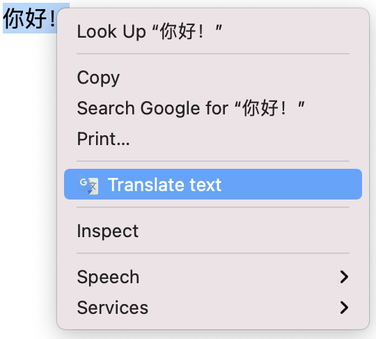
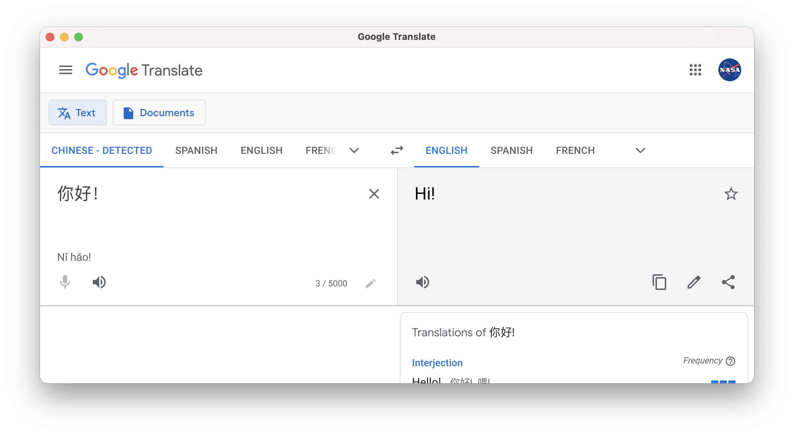

# Translate Text
Need to be able to translate text at a moment's notice? Never fear!

With this extension, simply select any text to translate, right click it, and select `Translate text`. A handy window will open up with Google Translate in it.

And, when you navigate to the options page, you can select a default language to translate to whenever you open the window. (Of course, you can also change the language when you're on the Google Translate page.)

# Convinced?
## Good! Downloading this is <s>really</s> pretty easy.

Either:
 - Download the source code as a ZIP.

 

Then unpack the ZIP.
 - Or if you have Git on your computer, use `git clone`.

Then, for

## Chrome:

Go to `chrome://extensions` and turn on developer mode if it isn't already.

Click "Load Unpacked" in the top left, then select the `chrome` directory within the downloaded repo. It should download successfully for you.

## Firefox:
Go to `about:debugging#/runtime/this-firefox` or simply `about:debugging` then 'This Firefox' and click "Load temporary addon...".

Then select `manifest.json` from the `firefox` directory from where you downloaded the repo to.

Once it's downloaded...

Try opening a new page or reloading a current page, then selecting some text and then right-clicking it. If you see an option that says "Translate text" in the right click menu, click it and it should open a Google Translate window.

(The extension, when downloaded or reloaded, will only apply to pages that have been reloaded or loaded since the extension was downloaded or reloaded.)

# Questions? Concerns?
Open an issue or discussion or contact me <a href="https://scratch.mit.edu/users/gosoccerboy5#comments">on Scratch</a>.

All credits to the logo go to <a href="https://translate.google.com">Google Translate</a>'s <a href="https://translate.google.com/favicon.ico">favicon</a>.